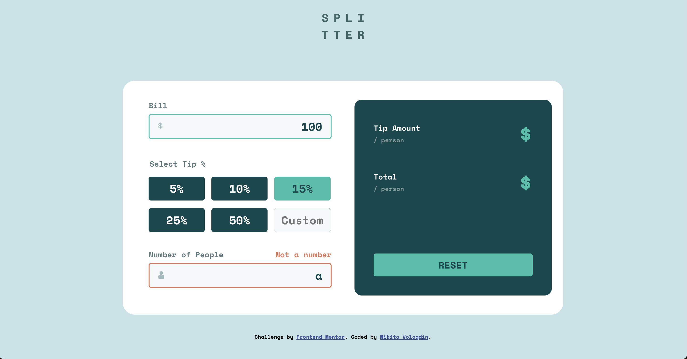

# Frontend Mentor - Tip calculator app solution

This is a solution to the [Tip calculator app challenge on Frontend Mentor](https://www.frontendmentor.io/challenges/tip-calculator-app-ugJNGbJUX). Frontend Mentor challenges help you improve your coding skills by building realistic projects.

## Table of contents

- [Overview](#overview)
  - [The challenge](#the-challenge)
  - [Screenshot](#screenshot)
  - [Links](#links)
  - [Built with](#built-with)
  - [What I learned](#what-i-learned)
  - [Continued development](#continued-development)
- [Author](#author)

## Overview

The tip calculator app has a layout for mobile and desktop versions. Uses css grid and flexbox. Shows success and error states via style on input. The app has client-side validation on inputs and displays an error message according to input validation failure. The app can display results up to 8 digit number. The reset button clears inputs and results. Added TypeScript.

### The challenge

Users should be able to:

- View the optimal layout for the app depending on their device's screen size
- See hover states for all interactive elements on the page
- Calculate the correct tip and total cost of the bill per person

### Screenshot

### Links

- Solution URL: [https://github.com/NikitaVologdin/Tip-calculator-app](https://github.com/NikitaVologdin/Tip-calculator-app)
- Live Site URL: [https://tip-calculator-app-five-phi.vercel.app/](https://tip-calculator-app-five-phi.vercel.app/)

## My process

### Built with

- Semantic HTML5 markup
- CSS custom properties
- Flexbox
- CSS Grid
- Mobile-first workflow
- Vanilla JavaScript
- TypeScript

### What I learned

I improved my knowledge of css grid also learned advance selectors.

### Continued development

I am getting more and more interesting in accessibility. Thinking of advancing this project JS to TS.

## Author

- Website - [Nikita Vologdin](https://vologdin.eu/portfolio)
- Frontend Mentor - [@NikitaVologdin](https://www.frontendmentor.io/profile/NikitaVologdin)
